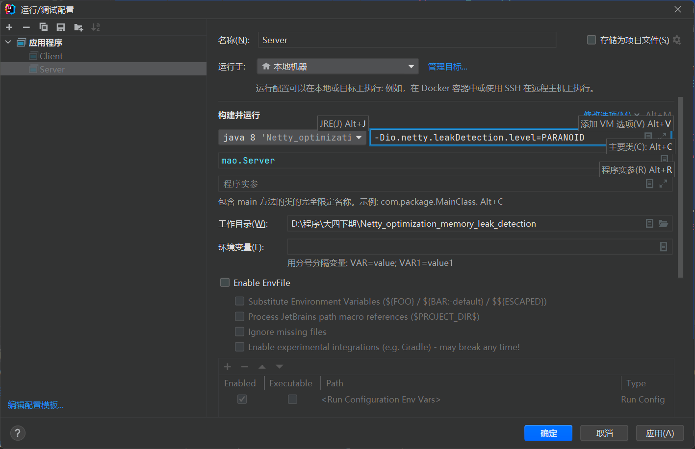

## 内存泄露检测工具

Netty中内存泄露大多数发生于申请了资源，但是资源用完了未释放，最终导致的OOM，一般情况我们上线前都需要开启一次内存泄露检测，检测没问题了之后才能够上线


Netty中内存检测工具名称叫做**ResourceLeakDetector**


### 开启


Netty开启检测需要在启动脚本中添加下面参数：

```sh
-Dio.netty.leakDetection.level=PARANOID
```


其中的`PARANOID`表示内存泄漏检测等级，共有四个等级：

- **DISABLED：** 表示禁用内存泄露检测
- **SIMPLE：** 默认的内存泄露检测级别，简单的采样资源泄漏检测，报告是否存在泄漏，开销较小
- **ADVANCED：** 高级采样资源泄漏检测，以报告最近访问泄漏对象的位置，代价是高昂的开销
- **PARANOID：** 启用偏执资源泄漏检测，报告最近访问泄漏对象的位置，代价是可能的最高开销（仅用于测试目的）


`SIMPLE`、`ADVANCED`、`PARANOID`的区别：`SIMPLE`只会告诉你泄露了，但是不告诉你泄露位置，`ADVANCED`会记录内存泄漏的位置。`SIMPLE`和`ADVANCED`是以一定频率启动的，并不会跟踪所有对象，但是`PARANOID`意为偏执，会跟踪检测所有对象，并记录内存泄漏的位置。


- Netty中默认检测级别是 `SIMPLE`，并不是每次都检测；
- 需要GC之后，才有可能检测到，因为`SIMPLE`和`ADVANCED`是以一定频率，所以并不是一定能够检测到；
- 泄漏打印才用的是日志的error级别，如果日志未打开error级别则打印不到。


### 测试

在服务器端的handle中申请了ByteBuf，但是未释放


```java
package mao;

import io.netty.bootstrap.ServerBootstrap;
import io.netty.buffer.ByteBuf;
import io.netty.channel.ChannelHandlerContext;
import io.netty.channel.ChannelInitializer;
import io.netty.channel.SimpleChannelInboundHandler;
import io.netty.channel.nio.NioEventLoopGroup;
import io.netty.channel.socket.nio.NioServerSocketChannel;
import io.netty.channel.socket.nio.NioSocketChannel;
import io.netty.handler.codec.string.StringDecoder;
import io.netty.handler.logging.LogLevel;
import io.netty.handler.logging.LoggingHandler;
import lombok.SneakyThrows;
import lombok.extern.slf4j.Slf4j;

/**
 * Project name(项目名称)：Netty_optimization_memory_leak_detection
 * Package(包名): mao
 * Class(类名): Server
 * Author(作者）: mao
 * Author QQ：1296193245
 * GitHub：https://github.com/maomao124/
 * Date(创建日期)： 2023/4/24
 * Time(创建时间)： 21:04
 * Version(版本): 1.0
 * Description(描述)： 内存泄漏检测-服务端
 */

@Slf4j
public class Server
{
    @SneakyThrows
    public static void main(String[] args)
    {
        new ServerBootstrap()
                .group(new NioEventLoopGroup(), new NioEventLoopGroup())
                .channel(NioServerSocketChannel.class)
                .childHandler(new ChannelInitializer<NioSocketChannel>()
                {
                    @Override
                    protected void initChannel(NioSocketChannel ch) throws Exception
                    {
                        ch.pipeline().addLast(new LoggingHandler(LogLevel.DEBUG))
                                .addLast(new StringDecoder())
                                .addLast(new SimpleChannelInboundHandler<String>()
                                {
                                    @Override
                                    protected void channelRead0(ChannelHandlerContext ctx, String msg) throws Exception
                                    {
                                        log.debug("读事件：" + msg);
                                        //申请空间，不释放
                                        ByteBuf buffer = ctx.alloc().buffer(81920);
                                    }

                                    @Override
                                    public void exceptionCaught(ChannelHandlerContext ctx, Throwable cause)
                                            throws Exception
                                    {
                                        log.error("错误：", cause);
                                        super.exceptionCaught(ctx, cause);
                                    }
                                });
                    }
                })
                .bind(8080)
                .sync();
    }
}
```


添加VM options参数




客户端发送消息10000次

```java
package mao;

import io.netty.bootstrap.Bootstrap;
import io.netty.channel.Channel;
import io.netty.channel.ChannelInitializer;
import io.netty.channel.nio.NioEventLoopGroup;
import io.netty.channel.socket.nio.NioSocketChannel;
import io.netty.handler.codec.string.StringEncoder;
import io.netty.handler.logging.LogLevel;
import io.netty.handler.logging.LoggingHandler;
import lombok.SneakyThrows;
import lombok.extern.slf4j.Slf4j;

import java.net.InetSocketAddress;

/**
 * Project name(项目名称)：Netty_optimization_memory_leak_detection
 * Package(包名): mao
 * Class(类名): Client
 * Author(作者）: mao
 * Author QQ：1296193245
 * GitHub：https://github.com/maomao124/
 * Date(创建日期)： 2023/4/24
 * Time(创建时间)： 21:09
 * Version(版本): 1.0
 * Description(描述)： 内存泄漏检测-客户端
 */

@Slf4j
public class Client
{
    @SneakyThrows
    public static void main(String[] args)
    {
        Channel channel = new Bootstrap()
                .group(new NioEventLoopGroup())
                .channel(NioSocketChannel.class)
                .handler(new ChannelInitializer<NioSocketChannel>()
                {
                    @Override
                    protected void initChannel(NioSocketChannel ch) throws Exception
                    {
                        ch.pipeline().addLast(new LoggingHandler(LogLevel.DEBUG))
                                .addLast(new StringEncoder());
                    }
                }).connect(new InetSocketAddress(8080))
                .sync()
                .channel();
        for (int i = 0; i < 10000; i++)
        {
            log.info(i + "");
            channel.writeAndFlush("hello" + i);
            //Thread.sleep(1);
        }
    }
}
```


先启动服务器，在启动客户端，然后服务器报错


```sh
2023-04-24  21:30:21.383  [nioEventLoopGroup-3-1] ERROR io.netty.util.ResourceLeakDetector:  LEAK: ByteBuf.release() was not called before it's garbage-collected. See https://netty.io/wiki/reference-counted-objects.html for more information.
Recent access records: 
Created at:
	io.netty.buffer.PooledByteBufAllocator.newDirectBuffer(PooledByteBufAllocator.java:349)
	io.netty.buffer.AbstractByteBufAllocator.directBuffer(AbstractByteBufAllocator.java:187)
	io.netty.buffer.AbstractByteBufAllocator.directBuffer(AbstractByteBufAllocator.java:178)
	io.netty.buffer.AbstractByteBufAllocator.buffer(AbstractByteBufAllocator.java:115)
	mao.Server$1$1.channelRead0(Server.java:53)
	mao.Server$1$1.channelRead0(Server.java:47)
	io.netty.channel.SimpleChannelInboundHandler.channelRead(SimpleChannelInboundHandler.java:105)
	io.netty.channel.AbstractChannelHandlerContext.invokeChannelRead(AbstractChannelHandlerContext.java:374)
	io.netty.channel.AbstractChannelHandlerContext.invokeChannelRead(AbstractChannelHandlerContext.java:360)
	io.netty.channel.AbstractChannelHandlerContext.fireChannelRead(AbstractChannelHandlerContext.java:352)
	io.netty.handler.codec.MessageToMessageDecoder.channelRead(MessageToMessageDecoder.java:102)
	io.netty.channel.AbstractChannelHandlerContext.invokeChannelRead(AbstractChannelHandlerContext.java:374)
	io.netty.channel.AbstractChannelHandlerContext.invokeChannelRead(AbstractChannelHandlerContext.java:360)
	io.netty.channel.AbstractChannelHandlerContext.fireChannelRead(AbstractChannelHandlerContext.java:352)
	io.netty.handler.logging.LoggingHandler.channelRead(LoggingHandler.java:241)
	io.netty.channel.AbstractChannelHandlerContext.invokeChannelRead(AbstractChannelHandlerContext.java:374)
	io.netty.channel.AbstractChannelHandlerContext.invokeChannelRead(AbstractChannelHandlerContext.java:360)
	io.netty.channel.AbstractChannelHandlerContext.fireChannelRead(AbstractChannelHandlerContext.java:352)
	io.netty.channel.DefaultChannelPipeline$HeadContext.channelRead(DefaultChannelPipeline.java:1421)
	io.netty.channel.AbstractChannelHandlerContext.invokeChannelRead(AbstractChannelHandlerContext.java:374)
	io.netty.channel.AbstractChannelHandlerContext.invokeChannelRead(AbstractChannelHandlerContext.java:360)
	io.netty.channel.DefaultChannelPipeline.fireChannelRead(DefaultChannelPipeline.java:930)
	io.netty.channel.nio.AbstractNioByteChannel$NioByteUnsafe.read(AbstractNioByteChannel.java:163)
	io.netty.channel.nio.NioEventLoop.processSelectedKey(NioEventLoop.java:697)
	io.netty.channel.nio.NioEventLoop.processSelectedKeysOptimized(NioEventLoop.java:632)
	io.netty.channel.nio.NioEventLoop.processSelectedKeys(NioEventLoop.java:549)
	io.netty.channel.nio.NioEventLoop.run(NioEventLoop.java:511)
	io.netty.util.concurrent.SingleThreadEventExecutor$5.run(SingleThreadEventExecutor.java:918)
	io.netty.util.internal.ThreadExecutorMap$2.run(ThreadExecutorMap.java:74)
	io.netty.util.concurrent.FastThreadLocalRunnable.run(FastThreadLocalRunnable.java:30)
	java.lang.Thread.run(Thread.java:750)
```


